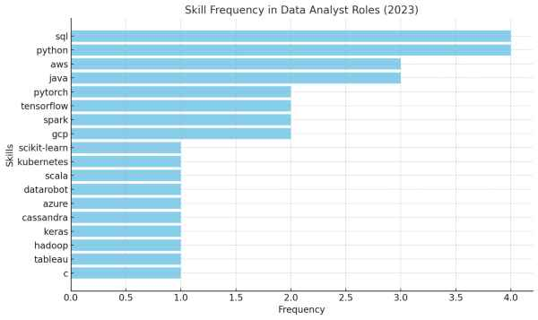

# Introduction
     
   In the ever-evolving landscape of the global job market, understanding the factors that drive employability and compensation has become more critical than ever. The rapid growth of technology, coupled with the increasing reliance on data-driven decision-making, has shifted the demand for skills and created new high-paying roles across various industries.

   SQL queries? Check them out here :
   [project_sql folder](/project_sql/)


   # Background
   Over the past decade, the global economy has undergone significant transformations, driven by advancements in technology, globalization, and changing consumer behaviors. These shifts have not only influenced the types of jobs available but also the skills required to perform them effectively. For instance, the rise of automation and artificial intelligence has replaced many routine tasks while creating demand for expertise in machine learning, data analytics, and cloud computing.

   Additionally, the COVID-19 pandemic accelerated remote work and digital transformation, reshaping traditional work environments and emphasizing the importance of adaptability and digital literacy. As industries strive to recover and innovate, the demand for specialized skills in technology, data science, and leadership has surged, creating a competitive landscape for job seekers.

   ### This project aims to delve into key questions surrounding the current job market dynamics, including:

   1. **Top Paying Jobs:** Which roles are offering the highest salaries, and what industries are they concentrated in?

   2. **Top Paying Job Skills:** What are the skills associated with these high-paying roles, and how do they contribute to organizational success?

   3. **Top Demand Skills:** What competencies are most sought after by employers, and how do they reflect emerging trends?

   4. **Top Paying Skills:** Beyond demand, which skills have the highest financial value in the job market?

   5. **Optimal Skills for Career Growth:** How can individuals strategically acquire and combine skills to maximize their earning potential and career prospects?

   By analyzing data from job postings, salary reports, and skill trends, this study seeks to provide actionable insights for students, professionals, and educators. With these findings, stakeholders can make informed decisions about career development, hiring strategies, and educational programs, aligning their efforts with the demands of a rapidly changing world.

   # Tools I used 
   to dive into the data job analysis market, I harnessed the power of several key tools :

   - **SQL:** A powerful language for querying, managing, and analyzing data in relational databases, enabling efficient data exploration and insight generation.

   - **PostgreSQL:** An open-source relational database management system used for storing, organizing, and retrieving data with advanced features for handling complex queries.

   - **Visual Studio Code:** A lightweight and versatile code editor utilized for writing, debugging, and managing code, with extensions that simplify development tasks.

   - **Git & GitHub:** Tools for version control and collaboration, allowing systematic tracking of code changes and seamless sharing of project files across team members.

   # The analysis
   Each query for this project aimed at investigating specific aspect of the data analysist job market. here's how I approached each question:

   ### 1. **Top Paying Data analyst Jobs:** 
   To identify the highest-paying job roles, I filtered data analyst postions by yearly salary and location, focusing on remote jobs. this query highlights the high paying opportunities in the field.

   ```sql
   SELECT
        job_id,
        job_title,
        job_location,
        job_schedule_type,
        salary_year_avg,
        job_posted_date,
        name as company_name

   FROM    job_postings_fact

   LEFT JOIN company_dim on job_postings_fact.company_id = company_dim.company_id

   WHERE   job_title_short = 'Data Scientist' AND
         job_location = 'Anywhere' AND
         salary_year_avg IS NOT NULL

   ORDER BY
         salary_year_avg DESC

   LIMIT   10 
   ``` 


   Here's the breakdown of the top data analyst job in 2023:
   - **Wide Salary Range:** Top 10 paying data analyst role span from $184,000 to $650,000. this indicate a significant salary potentiel in the fied.

   - **Diverse Employers:** companies like SmartAssaet, Meta, AT&T are among those offering high salaries, showing a broad interest accross different industries.

   - **job Title Variety:** there's a high diversity in the job titles, from Data Analyst to Director of Analytics, reflecting varied roles and specializations within data analytics. 
   

 ### 2. **Skills for top paying Jobs:** 

 To understand what skills are required for the top-paying jobs, I joined the job postings with the skills data, providing insights into what employers value for high-compensation roles.

 ```sql
WITH top_paying_jobs AS (
        SELECT
                job_id,
                job_title,
                salary_year_avg,
                name as company_name

        FROM    job_postings_fact

        LEFT JOIN company_dim on job_postings_fact.company_id = company_dim.company_id

        WHERE   job_title_short = 'Data Scientist' AND
                job_location = 'Anywhere' AND
                salary_year_avg IS NOT NULL

        ORDER BY
                salary_year_avg DESC

        LIMIT   10
)

SELECT
        top_paying_jobs.*,
        skills
FROM top_paying_jobs
INNER JOIN skills_job_dim ON top_paying_jobs.job_id = skills_job_dim.job_id
INNER JOIN skills_dim ON skills_job_dim.skill_id = skills_dim.skill_id
ORDER BY
        salary_year_avg DESC
```


Here are the insights from the "skills" column:

- **Top Skills by Frequency:**

- **SQL and Python** are the most frequently required skills, each appearing in 12.5% of job postings.
- **AWS and Java** follow, each appearing in 9.375% of postings.
Diverse Technical Skills:

- Skills like - **PyTorch, TensorFlow, Spark, and GCP** are moderately represented (6.25% each).
Specialized tools and platforms such as **Tableau, Azure, Hadoop, Keras, and Cassandra** appear less frequently (3.125% each).
Skill Trends:

The presence of cloud computing platforms **(AWS, GCP, Azure)** highlights the importance of cloud skills in data analysis roles.
**Machine learning frameworks (PyTorch, TensorFlow, scikit-learn)** show a significant demand for expertise in AI/ML.

### 3. In-Demand skills for Data Analysts 

This query helped identify the skills most frequently requested in job postings, directing focus to areas with high demand.

```sql

SELECT
        skills,
        COUNT(skills_job_dim.job_id) AS demand_count

FROM job_postings_fact

INNER JOIN skills_job_dim ON job_postings_fact.job_id = skills_job_dim.job_id
INNER JOIN skills_dim ON skills_job_dim.skill_id = skills_dim.skill_id
WHERE
        job_title_short = 'Data Analyst' AND
        job_work_from_home = TRUE
GROUP BY 
        skills  
ORDER BY
        demand_count DESC
LIMIT 5   
```
Here's is the breakdown of the most demanded skills for data analysis in 2023
- **SQL** and **Excel** remain fundamental, emphasizing the need for sttrong foundational skills in data processing and data manipulation.
- **programming** and **Tisualization tools** like **Python**, **Tableau**, and **Power BI** are essential, pointing towards the increasing importance of technical skills in data storytelling and decision support.


| Skills     | Demand_Count |
|------------|---------------|
| SQL        | 7291          |
| Excel      | 4611          |
| Python     | 4330          |
| Tableau    | 3745          |
| Power BI   | 2609          |


**table of the demand for the top 5 skills in data analysis job postings**

### 4. Skills based on salary

Exploring the average salaries associated with different skills revealed which skills are the highest paying.

```sql

SELECT
        skills,
       ROUND (AVG(salary_year_avg), 0) as avg_salary
    

FROM job_postings_fact

INNER JOIN skills_job_dim ON job_postings_fact.job_id = skills_job_dim.job_id
INNER JOIN skills_dim ON skills_job_dim.skill_id = skills_dim.skill_id
WHERE
        job_title_short = 'Data Analyst' AND
        salary_year_avg IS NOT NULL
        --job_work_from_home = TRUE
GROUP BY 
        skills 
ORDER BY
        avg_salary DESC
     
LIMIT 25   
```
**Here's is the breakdown of what I found. this explain clearly why some skills pay more.**

- **Big Data and ML Skills
SQL:** High demand for database management and querying large datasets is ubiquitous across industries.

- **Python:** Versatile language used in data analysis, machine learning, and web development makes it an invaluable asset.

- **Couchbase:** Specialized NoSQL database skills are rare, pushing up the market value.

- **Software Development and Deployment Proficiency
GitLab:** Comprehensive platform for DevOps and collaborative work environments. Skills in this area streamline development cycles.

- **Terraform:** Infrastructure as Code (IaC) capabilities make deployment and management scalable and efficient, highly prized in modern development environments.

- **Ansible:** Configuration management and automation make infrastructure maintenance more efficient, critical in large scale environments.

- **Cloud Computing Expertise
VMware:** Skills in virtualization are essential for large enterprises to efficiently run multiple operating systems on a single hardware platform.

- **Puppet:** Managing complex cloud environments and deploying configurations automatically enhances efficiency.

- **Terraform:** Consistent with software development, also relevant for cloud infrastructure provisioning, emphasizing its versatility and importance.

## Top-Paying Skills and Average Salaries

| Skills       | Average Salary ($) |
|--------------|--------------------|
| SVN          | 400,000            |
| Solidity     | 179,000            |
| Couchbase    | 160,515            |
| DataRobot    | 155,486            |
| Golang       | 155,000            |
| MXNet        | 149,000            |
| dplyr        | 147,633            |
| VMware       | 147,500            |
| Terraform    | 146,734            |
| Twilio       | 138,500            |
| GitLab       | 134,126            |
| Kafka        | 129,999            |
| Puppet       | 129,820            |
| Keras        | 127,013            |
| PyTorch      | 125,226            |
| Perl         | 124,686            |
| Ansible      | 124,370            |
| Hugging Face | 123,950            |
| TensorFlow   | 120,647            |
| Cassandra    | 118,407            |
| Notion       | 118,092            |
| Atlassian    | 117,966            |
| Bitbucket    | 116,712            |
| Airflow      | 116,387            |
| Scala        | 115,480            |

### 5. Optimal skills 

Combining insights from demand ans salary data, this query aimed to pinpoint skills that are both in high demand and offering a strategic focus for skill development 

```sql
WITH skills_demand AS (
    SELECT
        skills_job_dim.skill_id,
        skills,
        COUNT(skills_job_dim.job_id) AS demand_count
    FROM job_postings_fact
    INNER JOIN skills_job_dim ON job_postings_fact.job_id = skills_job_dim.job_id
    INNER JOIN skills_dim ON skills_job_dim.skill_id = skills_dim.skill_id
    WHERE
        job_title_short = 'Data Analyst' AND
        salary_year_avg IS NOT NULL AND
        job_work_from_home = true
    GROUP BY 
        skills_job_dim.skill_id, skills_dim.skills  -- Added table name here
), average_salary AS (
    SELECT
        skills_job_dim.skill_id,
        skills,
        ROUND(AVG(salary_year_avg), 0) AS avg_salary
    FROM job_postings_fact
    INNER JOIN skills_job_dim ON job_postings_fact.job_id = skills_job_dim.job_id
    INNER JOIN skills_dim ON skills_job_dim.skill_id = skills_dim.skill_id
    WHERE
        job_title_short = 'Data Analyst' AND
        salary_year_avg IS NOT NULL AND
        job_work_from_home = true
    GROUP BY 
        skills_job_dim.skill_id, skills_dim.skills  -- Added table name here
)

SELECT
    skills_demand.skill_id, -- Specified table name here
    skills_demand.skills,
    skills_demand.demand_count,
    average_salary.avg_salary
FROM skills_demand
INNER JOIN average_salary ON skills_demand.skill_id = average_salary.skill_id
WHERE demand_count > 10
ORDER BY
       avg_salary DESC,
      demand_count DESC
LIMIT 25
```
## Top-Paying Skills with Demand Count

| Skill ID | Skills      | Demand Count | Average Salary ($) |
|----------|-------------|--------------|-------------------|
| 8        | Go          | 27           | 115,320           |
| 234      | Confluence  | 11           | 114,210           |
| 97       | Hadoop      | 22           | 113,193           |
| 80       | Snowflake   | 37           | 112,948           |
| 74       | Azure       | 34           | 111,225           |
| 77       | BigQuery    | 13           | 109,654           |
| 76       | AWS         | 32           | 108,317           |
| 4        | Java        | 17           | 106,906           |
| 194      | SSIS        | 12           | 106,683           |
| 233      | Jira        | 20           | 104,918           |

*table of the most optimal skills for data analyst sorted by salary*

Here's is the breakdown of the most optimal skills for data analyst in 2023:

**1. Big Data and Data Management Skills**

Hadoop and Snowflake are particularly spotlighted due to their substantial demand and good salaries.

BigQuery also highlights demand in the data querying space, although it sees a slightly lower demand count compared to Snowflake.

**2. Cloud Computing Expertise**

Azure and AWS are leading cloud competencies, illustrating high demand and attractive salaries.

Enterprises investing in cloud migrations and platforms power this trend.

**3. Software Development and Deployment**

Java remains a staple for software development with decent demand and salary.

Go, a modern programming language, reflects both high demand and exceptional compensation, emphasizing its rising popularity.

**4. Project Management & Collaboration Tools**

Confluence and Jira significantly reflect the importance of collaboration and project management tools in the tech workforce.

Their average salaries mirror the integral role they play in streamlining project workflows and enhancing productivity.

**This data suggests a robust demand and compensation landscape for professionals skilled in data management, cloud computing, and development. Companies are willing to pay a premium for expertise that drives efficiencies and innovation in these domains.**


# What I learned

Through this project, I gained valuable insights into the data analytics job market, including the wide salary range and diverse job titles available. I learned about the high demand for data analytics skills across various industries and the significant salary potential for top-paying roles. Additionally, I discovered the importance of specific skills such as data management, cloud computing, and development, which are highly valued by employers and command premium salaries.

On a personal level, I enhanced my skills in SQL and data analysis, improved my ability to interpret and visualize data, and gained a deeper understanding of the factors that influence job market trends in the tech industry.

   # Conclusions

## Insights

1. **Wide Salary Range**: The top 10 paying data analyst roles span from $184,000 to $650,000, indicating a significant salary potential in the field.
2. **Diverse Employers**: Companies like SmartAsset, Meta, and AT&T are among those offering high salaries, showing a broad interest across different industries.
3. **Job Title Variety**: There's a high diversity in job titles, from Data Analyst to Director of Analytics, reflecting varied roles and specializations within data analytics.
4. **High Demand Skills**: Skills such as data management, cloud computing, and development are highly valued by employers and command premium salaries.
5. **Remote Work Opportunities**: There is a notable presence of high-paying remote job opportunities for data analysts, indicating flexibility in work arrangements.

## Closing Thoughts

This project has provided a comprehensive overview of the data analytics job market, highlighting the lucrative opportunities and the essential skills required to excel in this field. The insights gained underscore the importance of continuous learning and skill development to stay competitive. As the demand for data analytics professionals continues to grow, those equipped with the right skills and knowledge will be well-positioned to take advantage of the high salary potential and diverse job opportunities available.


